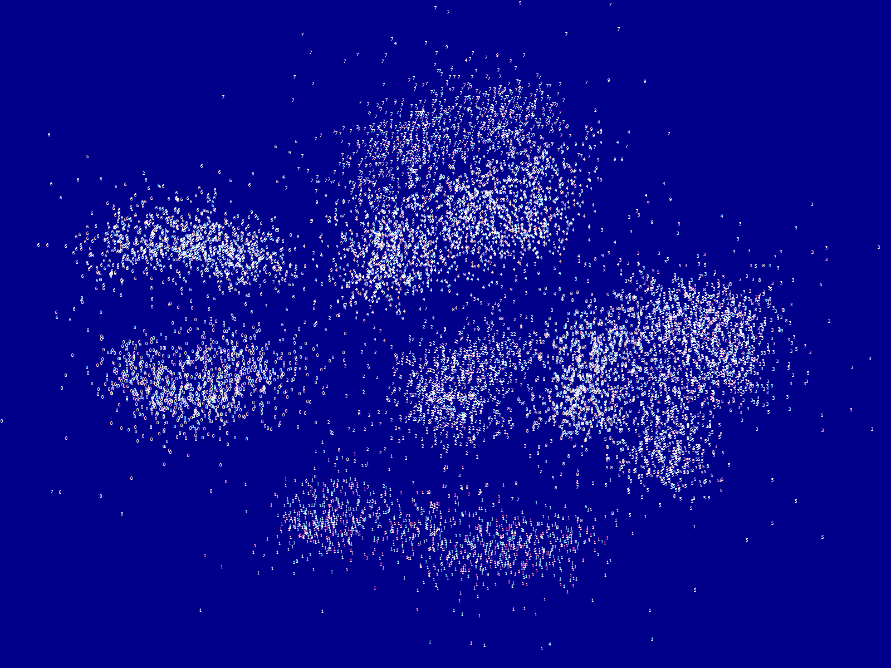

# UMAP C#

This is a C# reimplementation of the [JavaScript version](https://github.com/PAIR-code/umap-js), which was based upon the [Python version](https://github.com/lmcinnes/umap).

"Uniform Manifold Approximation and Projection (UMAP) is a dimension reduction technique that can be used for visualisation similarly to t-SNE, but also for general non-linear dimension reduction" - if you have a set of vectors representing document or entities then you might use the algorithm to reduce those vectors to two or three dimensions in order to plot them and explore clusters.

## Installation

Install via [NuGet](https://www.nuget.org/packages/UMAP):

```
Install-Package UMAP
```

## Usage

Instantiate a **Umap** instance, pass the array of vectors to the "InitializeFit" method, receive a recommended number of epochs to use from "InitializeFit", call the "Step" method this many times and then request the resulting (reduced dimension) vectors from the "GetEmbedding" method. The vectors passed to "InitializeFit" must all be of the same length. The vectors returned from "GetEmbedding" will be in the same order as the vectors passed to "InitializeFit" (so if you have labels relating to the source vectors then you can apply those labels to the embedding vectors).

```csharp
// It doesn't matter where this data comes from, so long as it is a
// float[][] and every nested array has the same length
float[][] vectors = ..

// Calculate embedding vectors using the default configuration
var umap = new Umap();
var numberOfEpochs = umap.InitializeFit(vectors);
for (var i = 0; i < numberOfEpochs; i++)
	umap.Step();

// This will be a float[][] where each nested array has two elements
// because the default Umap configuration generates 2D embeddings
var embeddings = umap.GetEmbedding();
```

## Configuration options

| Umap ctor argument   | Description                                                                        | Default                                                                                                                         |
| -------------------- | ---------------------------------------------------------------------------------- | ------------------------------------------------------------------------------------------------------------------------------- |
| `dimensions`         | The number of dimensions to project the data to (commonly 2 or 3)                  | 2                                                                                                                               |
| `distanceFn`         | A custom distance function to use                                                  | `Umap.DistanceFunctions.Cosine`                                                                                                 |
| `random`             | A pseudo-random-number generator for controlling stochastic processes              | `DefaultRandomGenerator.Instance` (unit tests use a fixed seed generator that disables parallelisation of the calculation       |
| `numberOfNeighbors`  | The number of nearest neighbors to construct the fuzzy manifold in `InitializeFit` | 15                                                                                                                              |

If the input vectors are all normalized and you want to project to three dimensions then you might use:

```csharp
var umap = new Umap(
	distance: Umap.DistanceFunctions.CosineForNormalizedVectors,
	dimensions: 3
);
```
## Parallelization support

This project uses a similar approach as Facebook's [fastText](https://github.com/facebookresearch/fastText) for lock-free multi-threaded optimization, by first [randomizing the order](https://github.com/curiosity-ai/umap-csharp/blob/ac636d76110f7cf8946976174c01a5609e0601eb/UMAP/Umap.cs#L291) each point is passed to the optimizer, and then, if using a thread-safe number generator, [running each optimization step multi-threaded](https://github.com/curiosity-ai/umap-csharp/blob/ac636d76110f7cf8946976174c01a5609e0601eb/UMAP/Umap.cs#L403). The assumption here is that collisions when [writing](https://github.com/curiosity-ai/umap-csharp/blob/ac636d76110f7cf8946976174c01a5609e0601eb/UMAP/Umap.cs#L424) to the projected embeddings vector will only happen at a very low probability, and will have minimum impact on the final results.

If it is not desirable for multiple threads to be used then `DefaultRandomGenerator.DisableThreading` may be provided as the **Umap**'s "random" constructor argument.

## A complete example

The "Tester" project is a console application that loads vectors that represent the [MNIST](http://yann.lecun.com/exdb/mnist/) data resized to 10x10 images and generates two images from it. One ("Output-Label.png") a visualisation that draw the labels (the numeric digit that exist vector represents, in this case) and the second ("Output-Color.png") a visualisation that plots each vector as a circle with a colour corresponding to the label.




To see how it looks in three dimensions, see [this CodePen example](https://codepen.io/anon/pen/XLamda) - this library was used to calculate embedding vectors from MNIST, which were then used to generate JavaScript to render the visualisation in 3D using [Plotly](https://plot.ly/javascript/).
